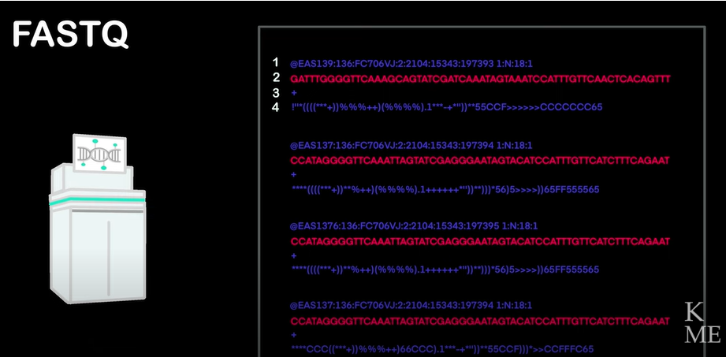

# Fastq,Bam and Sam files 

The output of the sequencing machine is a fastq file with the following structure:  

Each line consists of 150 bases called "reads."
First line - Read name, which machine it came from.
Second line - The actual sequence.
Third line - Usually a plus sign for aesthetics and separation.
Fourth line - A sequence of characters, where each character is assigned a value indicating the quality of the read at that nucleotide position in the sequence above.

What do we do when there is a lower quality score?
Usually, because the sequence is read more than once in the machine, often up to 30 times, if we have a base with low quality, it will be read another 30 times. This means we have 29 more reads covering the problematic point. Therefore, in the other readings, we can see what base should be there.

Fastq Contains our entire genome in small and unordered parts (much like an unassembled puzzle). If we want to take a specific read and see where it comes from in the genome, we won't be able to know that. For this purpose, there is the bam file - such a file provides results on the alignment of a specific fastq file with a genomic reference (the entire average human genome). In other words, the bam file organizes the reads according to the genome, assigning each read a specific order and position relative to the genome.

A bam file is a binary version, so if we try to read the file, we won't succeed. The equivalent file that can be read by a human is a sam file.

