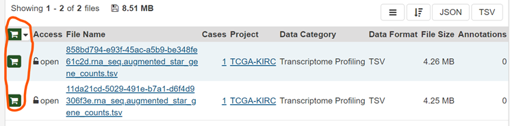
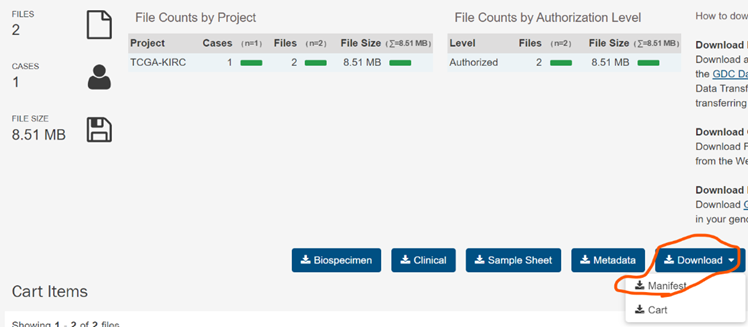

# Download controlled data from GDC:
The GDC contains NCI-generated data from some of the largest and most comprehensive cancer genomic datasets, including The Cancer Genome Atlas (TCGA) and Therapeutically Applicable Research to Generate Effective Therapies (TARGET).
How to do that ?
1.	To download data from GDC, install the GDC client on the server. Here are the instructions:
https://gdc.cancer.gov/access-data/gdc-data-transfer-tool
  Another option is to use Docker:   https://hub.docker.com/r/mgibio/gdc-client

2. Enter to GDC portal:  
https://portal.gdc.cancer.gov/

3. Search the files you intend to download and after adding them to cart
  
To download the data on the server, please select the 'Download Manifest File' option. 

 
4.	Copy the manifest file to the server using WinSCP, or create a new file on the server and paste the content of the manifest file from your local PC into the new file on the server.

5.	Run this command on server:  
`gdc-client download -m manifest.txt -t gdc-user-token.txt`  
**Note:   To acquire the 'gdc-user-token.txt' file, please reach out to me (Linoy). Alternatively, you can request it from Professor Sol Efroni.**
