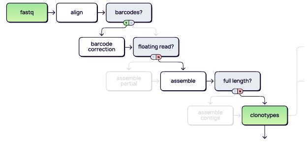

# MiXCR user guide (Efroni Lab)

# Table of contents: 

1. [What is MiXCR?](#about)
2. [Installation and License](#installation--licensing)
3. [Preprocessing](#preprocess)
4. [MiXCR Usage](#usage)

## About ##

MiXCR is a software platform for immune profiling with Next-Generation Sequencing (NGS) data. It is used by majority of Big Pharma in the R&D for vaccine development, 
antibody discovery and cancer immunotherapy research.

MiXCR provides a seamless analytical pipeline starting from raw sequencing data to biological insights. 
It works with any wet lab protocol and data types. 

It extracts repertores from target amplicon sequencing protocols with and without molecular barcodes, 
shotgun and RNA-Seq libraries, various single cell technologies and is flexible to be tuned for any custom protocol.

Out of the box, it provides dedicated analytical pipelines for all kits from popular commercial vendors, standard sequencing data types and widely adopted public protocols. 
The whole analytical pipeline can be conducted as easy as one line. Few examples:

### MiXCR Pipeline (under the hood) ### 

### Installation & Licensing ###

#### <u>Manual installation (Linux / MacOS)</u> : ####

Download and extract mixcr:

1. Create a folder where you want to install MiXCR and navigate to that folder. Bellow is the command that creates mixcr folder in your home directory.

> mkdir ~/mixcr

> cd ~/mixcr

Go to MiXCR GitHub page and copy the link for latest build. The command bellow downloads MiXCR v4.3.

2. For other builds replace the link with the one you obtained from GitHub.

wget https://github.com/milaboratory/mixcr/releases/download/v4.3.2/mixcr-4.3.2.zip
Unpack the zip archive using the unzip command

> `unzip mixcr-4.3.2.zip`

The output looks similar to this:

> `Archive:  mixcr-4.3.2.zip
  inflating: mixcr
  inflating: LICENSE
  inflating: mixcr.jar`

Check that mixcr works with the following command

> `~/mixcr/mixcr -v`

The output should look similar to:

> `MiXCR v4.3.2 (built Tue Apr 11 20:35:07 CEST 2023; rev=123d699964; branch=no_branch; host=fv-az364-276)
RepSeq.IO v1.8.0-21-master (rev=5521c5842b)
MiLib v2.4.0-7-master (rev=acea8397fe)
Built-in V/D/J/C library: repseqio.v2.2
Library search path:- built-in libraries - /Users/imyarek/mixcr-4.3.2/.`

Add MiXCR to your `$PATH`:

MiXCR is now installed. To run it requires entering the path to the executable command on the command line. We want to be able to run MiXCR by simply entering the word mixcr on the command line. To accomplish this, we add it to your $PATH variable. Go into the directory where you unpacked mixcr and enter pwd.

> `cd ~/mixcr/`

> `pwd`

The output will be the full path to MiXCR directory

>`/home/user/mixcr`

Then use the export command to add it into the `$PATH` variable.

> `export PATH=/home/user/mixcr:$PATH`

#### <u> Licensing </u>: ####

To run MiXCR one need a license file. MiXCR is free for academic users with no commercial funding.

Academic users can quickly get a license at https://licensing.milaboratories.com.

- Choose Academic license
- Follow instructions
- Enter academic email
- Activating license:
1. copy license number
      
      - The easiest way to activate the license is to run `activate-license` command and paste the content of the license key therein:

            > mixcr activate-license
            
            Please enter the license: ...

2. put mi.license file in the one of the following directories:

            ~/.mi.license
            ~/mi.license
            directory with mixcr.jar file
            directory with MiXCR executable

### Preprocess: ###

1. moving all fastq files into one folder:

`find /path/to/directory -name '*.gz' -exec mv {} . \;`

- This will search for all files with a `.gz` extension under `/path/to/directory`, 
- and for each file found, it will execute the mv command to move the file to the current directory (.)

2. merging lanes:

In case of sequencing files from several lanes you will need to concatenate them (**by order**) whether it is
[single-end/paired-end](https://www.illumina.com/science/technology/next-generation-sequencing/plan-experiments/paired-end-vs-single-read.html)

Assume you have the following set of files:

> sample1_R1_L001.fastq.gz | sample1_R1_L002.fastq.gz | sample1_R1_L003.fastq.gz | sample1_R1_L004.fastq.gz

> sample1_R2_L001.fastq.gz | sample1_R2_L002.fastq.gz | sample1_R2_L003.fastq.gz | sample1_R2_L004.fastq.gz

- in order to concatenate them you can either write your own `.sh` script
- or use MiXCR's code snippet example: to join sequencing files from several lanes on the fly which will run. the full pipeline including this preprocessing step.

`mixcr analyze <preset> \
      sample1_R1_L{{n}}.fastq.gz \
      sample1_R2_L{{n}}.fastq.gz \
      sample1_result`

MiXCR recognizes the following substitution elements in the input file names:

`{{n}}` - matching any number; with or without leading zeros input sequences will be sorted according to the number value

`{{a}}` - matches any symbol sequence; input sequences will be sorted lexicographically in respect to this matching group

`{{R}}` - special matching group that matches R1/R2/1/2, and matched value will be used to assign files to corresponding mate pairs

### Usage: ### 

In order to use MiXCR you first need to know which preset/protocol have been used
in your experiment.

- Sequencing type? (bulk/single-cell)
- Sequencing read type? (Single-end/Paired-end)
- What is the starting material? [(RNA/DNA)](https://www.ncbi.nlm.nih.gov/pmc/articles/PMC9369427/table/ijms-23-08590-t003/?report=objectonly)
- Which organism model? (Human/Mouse/etc..)
- Commercial kit used? (Takara/10x/immunoseq/etc..) --> usually in our lab we use **"SMARTer Human TCR a/b Profiling Kit v2"** by Takara
-

usage example for preset ("SMARTer Human TCR a/b Profiling Kit v2")

code:

`mixcr analyze takara-human-tcr-V2-cdr3 
      input_R1.fastq.gz 
      input_R2.fastq.gz 
      result`

- the `cdr3` preset used to reduce clonotype assembling feature from full V-D-J region to CDR3 only, 
you can either use `full-length` instead to retrieve CDR1&2 also.

- Use case for single sample, but in case of multiple samples you can loop through files
or use the following code for parallel:

`#!/usr/bin/env bash`

`mkdir -p results`

`ls raw/*R1* |
    parallel -j 2 --line-buffer \
    "mixcr analyze <preset> \
    {} \
    {=s:R1:R2:=} \
    {=s:.*/:results/:;s:_R.*::=}"`

