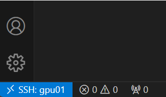

# Stuck Password Issue in VS Code

When the server suddenly stops, like when the VPN disconnects after not being used for a long time, it can make VS Code freeze. Here's a simple guide I wrote based on my own experience.

Issue Description:
I attempted to connect with the server, and each time it asked for a password. Even when the password was right, it kept showing the password window repeatedly, creating a loop.

Actions to Resolve:

Stop the ongoing process.
1. Open vs code window in remote mode
2. `ctrl + shipt + p`
3. In the prompt window, type:  `Remote-SSH: Kill VS Code Server on Host`
4. Once you receive a notification confirming the process has ended, navigate to the relevant server in the terminal (for example Moba), enter the directory where you use VS Code, and then type : `ll -a ` . This command shows hidden folders.
5. Remove this folder `rm -rf .vscode-server/` (For those feeling concerned, you can easily rename the folder, and if needed, revert it to its original name).
6. Next, attempt to access the remote extension and reconnect; it should function properly.

Once you've completed your tasks with the remote, it's crucial to exit in an organized manner.
Click on the remote symbol located at the lower left. Below, you'll find what is highlighted in 

light blue : 

**Then click on close remote connection**
