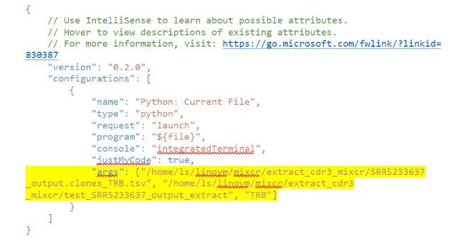

# Debuging with Args in VS Code
To debug a Python script with arguments in a way that helps avoid errors related to argument handling during debugging, you can follow these steps:

1. Press `run and debug` 

2. A launch .json file will be created where the script is located.
3. Add the part of args in the generated file as indicated here:

1. Click as in the picture to start debugging with args:

