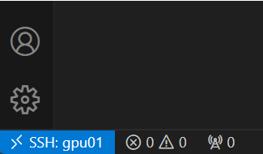
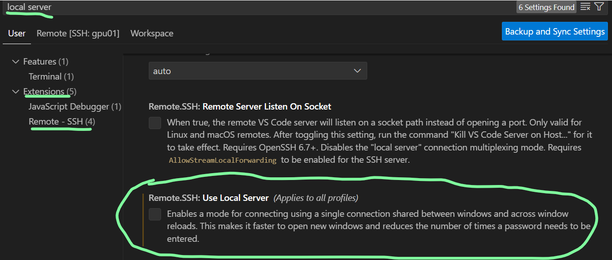

הכל עבד בצורה תקינה לאחר כמה ימים נתקלתי בבעיה.
תסמין הבעיה : 
נסיתי להתחבר לשרת וכל פעם זה דרש סיסמא, למרות שהסיסמא נכונה זה שוב הקפיץ את החלונית של הסיסמא וככה נתקע בלופ.
שלבי הפתרון:
1) עצירת התהליך שרץ כרגע
-להיכנס לvs code
-ללחוץ ctrl +shift+p 
-להקליד את הפקודה הבאה בחלונית שנפתחת :
Remote-SSH: Kill VS Code Server on Host
2) למחוק מהשרת את התיקיה של .vscode 
- בשרת עשיתי ll -a  כדי להציג תיקיות נסתרות
-  מחקתי את התיקיה של vs code. באמצעות הפקודה הבאה:
 rm -rf .vscode-server/

לאחר מכן לנסות להיכנס לexstintion של remote ולנסות להתחבר מחדש - אמור לעבוד .

אחרי שמסיימים לעבוד עם הremote חשוב לבצע יציאה מסודרת באופן הבא:
ללחוץ על הסימן של הremote מצד שמאל למטה, להלן מה שמסומן בתכלת:

ואז ללחוץ close remote connection 

איך לסדר את הבעיה לגמרי, כך שגם אם יוצאים יציאה לא מסודרת הבעיה לא תחזור:
1)
 -מצד שמאל ברגל ללחוץ על סמל הגדרות
-לאחר מכן ללחוץ על settings
-ללחוץ על extension
- ללחוץ על Remote-SSH 
- לחפש בהגדרות local server ולהוריד את הוי מההגדרה הבאה:

1) לבצע את שלב מספר 1 מלמעלה, להלן תזכורת
ללחוץ ctrl +shift+p 
-להקליד את הפקודה הבאה בחלונית שנפתחת :
Remote-SSH: Kill VS Code Server on Host

1) לנסות להתחבר מחדש.

